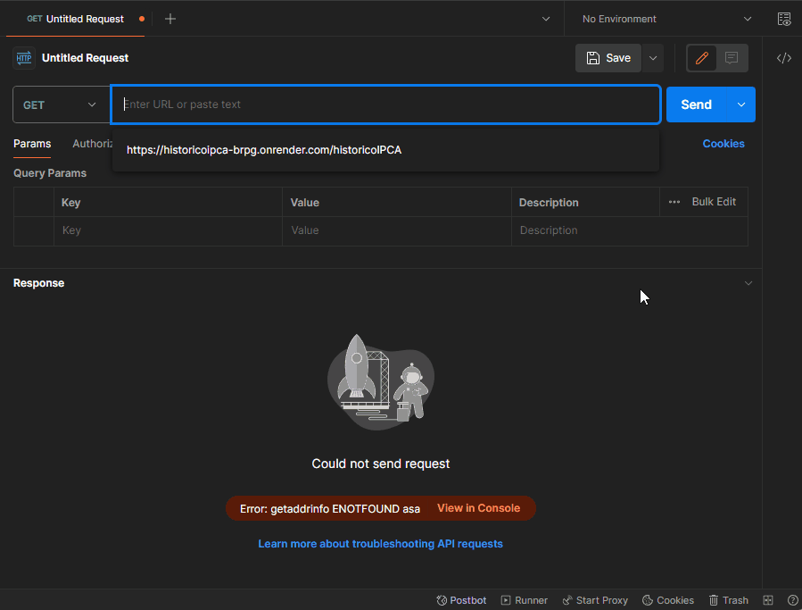

# API Histórico IPCA

A API Histórico IPCA foi desenvolvida para permitir que o front-end solicite dados do Índice Nacional de Preços ao Consumidor Amplo (IPCA) nos anos de 2015 a 2023. Esta documentação fornecerá informações detalhadas sobre como utilizar a API para obter históricos completos ou dados específicos do IPCA, além de oferecer a funcionalidade de cálculo de reajuste com base nos índices IPCA para um determinado período.

## Endpoints Disponíveis:

### 1. Histórico Completo do IPCA

Para obter todos os dados de históricos IPCA, utilize o seguinte endpoint:

- Endpoint: `https://historicoipca-brpg.onrender.com/historicoIPCA`

### 2. Dados Específicos do IPCA por Ano

Para buscar dados específicos do IPCA de um ano em particular, utilize o seguinte endpoint, substituindo "2020" pelo ano desejado:

- Endpoint: `https://historicoipca-brpg.onrender.com/historicoIPCA?ano=2020`

### 3. Cálculo de Reajuste

A API também oferece a funcionalidade de calcular o reajuste de um valor com base nos índices IPCA, para um período especificado. Os parâmetros necessários para o cálculo são:

- `valor`: Valor a ser reajustado.
- `mesInicial`: Mês inicial do período.
- `anoInicial`: Ano inicial do período.
- `mesFinal`: Mês final do período.
- `anoFinal`: Ano final do período.

Exemplo de uso:

- Valor: R$100,00
- Período: de janeiro/2015 a maio/2023
- Valor reajustado no período: R$103,83

Endpoint para cálculo: `https://historicoipca-brpg.onrender.com/historicoIPCA/calculo?valor=100&mesInicial=1&anoInicial=2015&mesFinal=5&anoFinal=2023`

Basta substituir os valores dos parâmetros conforme necessário.

## Ferramentas Utilizadas:

A API foi desenvolvida utilizando as seguintes ferramentas:

- Node.js
- RESTful API
- Express

Utilize esta API para acessar facilmente os dados históricos do IPCA, realizar consultas específicas e calcular reajustes com base nos índices IPCA para períodos definidos.